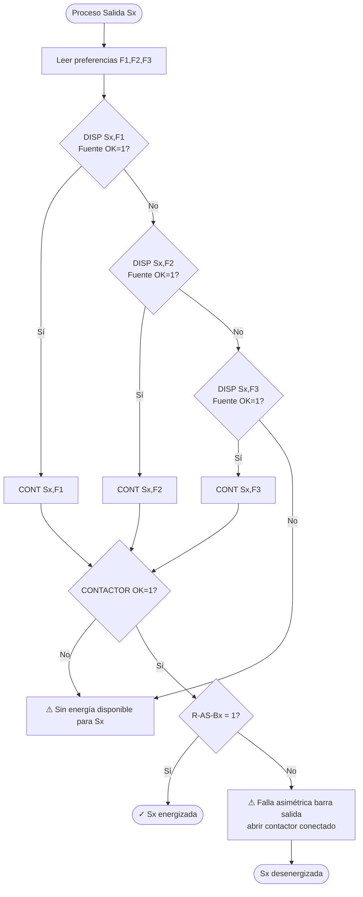

# 03 — Diagrama de Flujo (Fuente de Verdad de la Lógica)

Transcripción fiel del diagrama `Diagrama_Flujo_TTA_Ver_05.drawio`. Es la **fuente de
verdad** de la lógica. Si este documento y el código difieren, **el código está mal**.

El diagrama tiene tres bloques:
- **Proceso principal** (ciclo de control y procesamiento de S1, S2, S3).
- **Subproceso DISP** (disponibilidad de fuente).
- **Subproceso CONT** (maniobra y confirmación de contactores).

---

## A. Proceso principal

### A.1 Arranque y modo

```
INICIO DEL SISTEMA
  └─► Leer modo de operación (selector del Tablero TTA)
        MODO AUTO   : DI12=1, DI13=0
        MODO MANUAL : DI12=0, DI13=1
        FALLA SELECTOR: DI12=DI13 (0,0) o (1,1)
        │
        ▼
   ¿MODO AUTOMÁTICO?
     SÍ ─► MODO AUTOMÁTICO (control por software Experion) ──► (sigue A.2)
     NO ─► ¿MODO MANUAL?
              SÍ ─► MODO MANUAL (Experion no controla; operador actúa sobre KM
                    mediante selectores frontales) ──► (no hay transferencia auto)
              NO ─► ERROR en selector (Alarma Visual) ─► Se asume MODO MANUAL
```

### A.2 Lectura de entradas y blackout

```
Leer estado de entradas de energía:
  CB1 (PRINCIPAL), CB2 (DB A), CB3 (DB B)  → cerrado / falla-trip
  Relés de asimetría de barras: R-AS-P, R-AS-A, R-AS-B
        │
        ▼
Leer señal BLACKOUT (lectura remota desde otro proceso Experion)
        │
        ▼
   ¿BLACKOUT = 1?
     SÍ ─► KA-9 = 1 (DO15 MOXA 2) Activa relé control carga clima (bota carga no crítica)
     NO ─► KA-9 = 0 (DO15 MOXA 2) Desactiva relé control carga clima
        │
        ▼
  (Procesar salidas S1 → S2 → S3)
```

### A.3 Proceso de una salida (patrón común a S1, S2, S3)

El patrón es idéntico para las tres salidas: **las tres tienen 3 preferencias** (F1, F2,
F3) y admiten P/A/B. _Corrección documental: el `.drawio` Ver 05 dibujaba S3 con solo 2
preferencias (sin KM3-P); el documento "Modo funcionamiento TTA" indica que S3 también
admite PRINCIPAL, por lo que el motor implementa S3 con 3 preferencias y KM3-P. El
`flowLayout.json` del bundle sigue mostrando la versión antigua — ver `09-estado-actual.md`._

```
Proceso Salida Sx
  └─► Leer preferencias del Operador para Sx (F1, F2, F3)   [aplica a S1, S2 y S3]
        (Restricción: preferencias no se repiten)
        │
        ▼
   Verificar PREFERENCIA 1 → DISP(Sx, F1)
        │
        ▼
   ¿Fuente PREFERENCIA 1 disponible? (Fuente OK = 1)
     SÍ ─► CONT(Sx, F1) ──────────────────────────────┐
     NO ─► Verificar PREFERENCIA 2 → DISP(Sx, F2)      │
              │                                         │
              ▼                                         │
         ¿Fuente PREFERENCIA 2 disponible?              │
           SÍ ─► CONT(Sx, F2) ─────────────────────────┤
           NO ─► Verificar PREFERENCIA 3 → DISP(Sx, F3) │   [aplica también a S3]
                    │                                    │
                    ▼                                    │
              ¿Fuente PREFERENCIA 3 disponible?          │
                SÍ ─► CONT(Sx, F3) ──────────────────────┤
                NO ─► ⚠ ALARMA: Sin energía disponible   │
                       para la Salida Sx (desenergizada) │
                                                          │
        ┌─────────────────────────────────────────────────┘
        ▼
   ¿CONTACTOR OK = 1?
     NO ─► ⚠ ALARMA: Sin energía disponible para Sx (la maniobra falló)
     SÍ ─► Leer R-AS-Bx (asimetría barra de salida)
              │
              ▼
         ¿R-AS-Bx = 1?
           SÍ ─► ✓ Salida Sx ENERGIZADA (fuente conectada, barra sin falla)
           NO ─► ⚠ ALARMA: Falla Asimétrica en BARRA de salida Sx
                  │
                  ▼
              (Abrir el contactor de la fuente que estaba conectada)
              ¿Fuente = F1? SÍ ─► Abrir KMx-P ─► ¿Abrió? NO ─► ⚠ ALARMA Falla Contactor KMx-P
              ¿Fuente = F2? SÍ ─► Abrir KMx-A ─► ¿Abrió? NO ─► ⚠ ALARMA Falla Contactor KMx-A
                            NO ─► Abrir KMx-B ─► ¿Abrió? NO ─► ⚠ ALARMA Falla Contactor KMx-B
                  (Salida queda desenergizada)
```

> **Mapa de relés de asimetría de salida:** S1→R-AS-BP, S2→R-AS-BA, S3→R-AS-BB.
> **Mapa de contactores por salida:** S1→KM1-{P,A,B}, S2→KM2-{P,A,B}, S3→KM3-{P,A,B}.

Tras procesar S3, el flujo **retorna a "Leer modo de operación"** (↺ inicio del ciclo).

---

## B. Subproceso DISP — Disponibilidad de fuente

Entrada: `(Salida, Entrada)`. Salida: `Fuente OK = 0 | 1`.

```
SUBPROCESO DISP (Salida, Entrada)
  └─► Leer estado del interruptor CB de la fuente:
        CB1 para P1(P), CB2 para P2(A), CB3 para P3(B)
  └─► Leer estado de relés de asimetría de barras:
        R-AS-P (BARRA PRINCIPAL), R-AS-A (BARRA DB A), R-AS-B (BARRA DB B)
        │
        ▼
   (El diagrama ramifica por Salida y luego por Entrada, pero la prueba es la misma
    para toda combinación; se resume en la lógica canónica de abajo.)

   Para la fuente solicitada (P / A / B):
     ¿C-AUX CBn CERRADO = 1  Y  C-AUX CBn FALLA/TRIP = 0?
        NO ─► ⚠ ALARMA "Estado CBn Abierto/Falla/Trip"
               └─► Fuente OK = 0 (FALSE)
        SÍ ─► ¿R-AS-x = 1?
                 NO ─► ⚠ ALARMA "BARRA … sin energía"
                        └─► Fuente OK = 0 (FALSE)
                 SÍ ─► Fuente OK = 1 (TRUE)
        │
        ▼
   Retorno al Proceso principal desde donde fue llamado.
```

**Lógica canónica (equivalente, lo que debe implementarse):**

```
disponible(fuente) =
      C_AUX[fuente].CERRADO == 1
  AND C_AUX[fuente].FALLA_TRIP == 0
  AND R_AS_entrada[fuente] == 1
```

donde `fuente ∈ {P→CB1/R-AS-P, A→CB2/R-AS-A, B→CB3/R-AS-B}`.

> Nota de fidelidad: el `.drawio` despliega el árbol Salida→Entrada de forma
> explícita (muchas ramas repetidas) para las combinaciones de S1/S2/S3 × P1/P2/P3.
> Todas evalúan la misma condición canónica anterior. Implementar una sola función
> parametrizada por fuente; los tests cubren cada combinación (ver `07`).

---

## C. Subproceso CONT — Maniobra y confirmación de contactores

Entrada: `(Salida, Entrada)`. Salida: `CONTACTOR OK = 0 | 1`.

```
SUBPROCESO CONT (Salida, Entrada)
  └─► Leer estado del interruptor CB de la fuente (CB1/CB2/CB3)
        │
        ▼
   Ramificar por (Salida, Entrada) y ejecutar:
     1) ABRIR los OTROS contactores de esa salida (exclusividad)
     2) Confirmar que abrieron (leer ESTADO KM); si no → ALARMA, CONTACTOR OK = 0
     3) CERRAR el contactor de la fuente elegida
     4) Confirmar que cerró (leer ESTADO KM); si no → ALARMA, CONTACTOR OK = 0
     5) Si todo confirmó → CONTACTOR OK = 1
        │
        ▼
   Retorno al Proceso principal desde donde fue llamado.
```

**Tabla de maniobras (extraída del diagrama):**

| Salida | Entrada | Abrir (otros) | Cerrar (elegido) |
|--------|---------|---------------|------------------|
| S1 | P | KM1-A, KM1-B | KM1-P |
| S1 | A | KM1-P, KM1-B | KM1-A |
| S1 | B | KM1-P, KM1-A | KM1-B |
| S2 | P | KM2-A, KM2-B | KM2-P |
| S2 | A | KM2-P, KM2-B | KM2-A |
| S2 | B | KM2-P, KM2-A | KM2-B |
| S3 | P | KM3-A, KM3-B | KM3-P |
| S3 | A | KM3-P, KM3-B | KM3-A |
| S3 | B | KM3-P, KM3-A | KM3-B |

Para cada apertura: `¿Abrió(eron) Contactor(es)?` → NO ⇒ "Estado KMx-y Falla
Contactor (Alarma Visual)" + `CONTACTOR OK = 0`.
Para el cierre: `¿Cierra Contactor KMx-y?` → NO ⇒ "Falla Contactor KMx-y (Alarma
Visual)" + `CONTACTOR OK = 0`; SÍ ⇒ `CONTACTOR OK = 1`.

---

## D. Equivalente Mermaid (lógica principal de una salida)

Vista legible para revisión; no sustituye a las secciones A–C.



> Las tres salidas (S1, S2, S3) usan el patrón completo con los tres niveles D1/D2/D3.

---

## E. Notas de trazabilidad

- Cada nodo `⚠ ALARMA` del diagrama mapea a una alarma del catálogo en `02` (AL-0x).
- El orden de procesamiento es estrictamente **S1 → S2 → S3** y luego reinicio del ciclo.
- El subproceso DISP **no** abre ni cierra contactores; solo evalúa disponibilidad.
- El subproceso CONT es el **único** que maniobra contactores y es donde vive la
  regla de exclusividad (RN-30).
